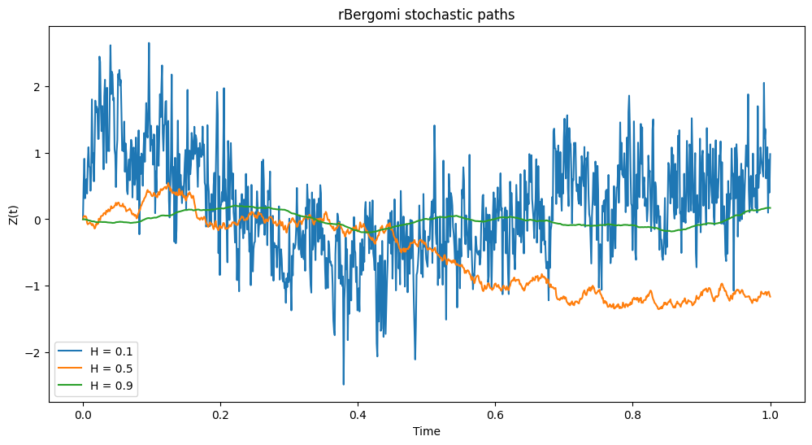
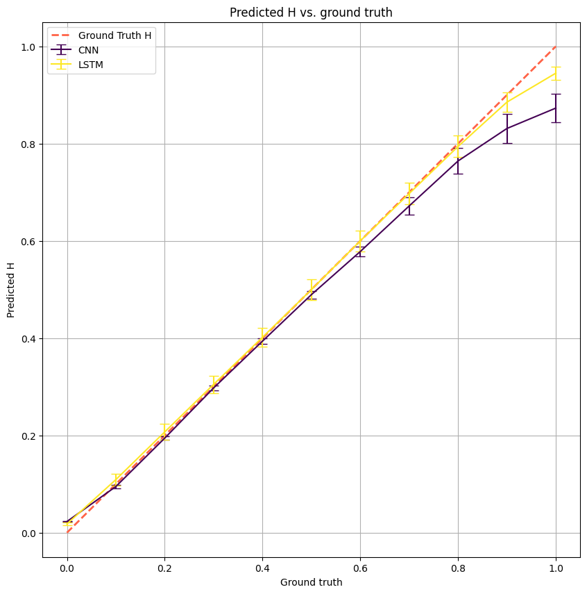
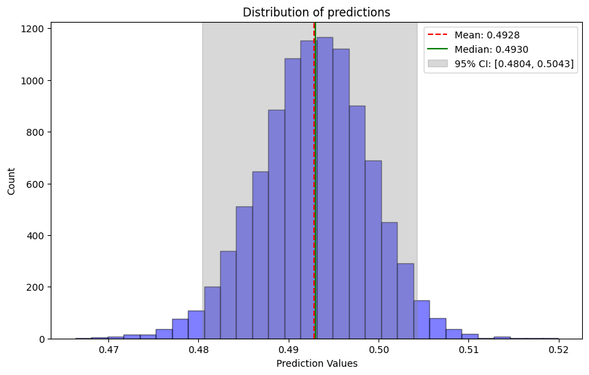
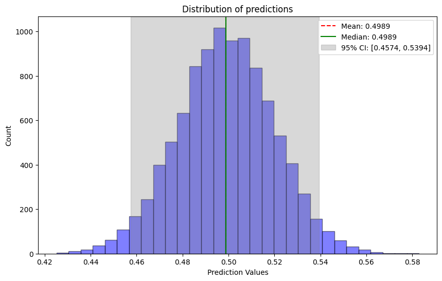

# Calibrating Rough Volatility Models with Neural Networks

## Methodology

This project proposes the use of convolutional neural networks (CNNs) to calibrate a rough volatility model, specifically the rBergomi model. It follows the methodology from [[1]](#ref1) and tests LSTMs as an alternative. The objective is to estimate the Hölder exponent of a stochastic process from simulated trajectories. 

A process $(X_{t})_{t\ge0}$ is Hölder-continuous with an exponent $h$ if it verifies:

$$
|X_{t}-X_{s}|\le C|t-s|^h, \quad s,t \ge 0
$$

where $C$ is a constant. In this context, low values translate to a "rougher" trajectory, while values closer to 1 produce a smoother curve.

The rBergomi model defines the price (of a stock, for example) as follows:

$$
S_{t} = S_{0} \exp \left( \int_{0}^{t} \sqrt{v_{s}} dB_{s} - \frac{1}{2} \int_{0}^{t} v_{s} ds \right)
$$

with the variance process defined as:

$$
v_{t} = v_{0} \exp \left( Z_{t} - \frac{\eta^{2}}{2} t^{2\alpha+1} \right)
$$
$$
Z_{t} = \int_{0}^{t} K_{\alpha}(s,t) dW_{s}, \quad K_{\alpha}(s,t) := \eta\sqrt{2\alpha+1}(t-s)^{\alpha}
$$

where $\alpha \in (-\frac{1}{2}, 0]$, and $W$ and $B := \rho W + \sqrt{1-\rho^{2}}W^{\perp}$ are Brownian motions.

The model aims to learn and predict the Hölder exponent ($H = \alpha + \frac{1}{2}$ in this model) by training on trajectories of the process $Z$.

## Architecture

The primary architecture used is a Convolutional Neural Network consisting of 1D convolution layers and pooling layers. We also implemented an LSTM (Long Short-Term Memory) network, which processes the trajectories using a sliding window approach. 

## CNN and LSTM Comparison

We sampled 2000 values of $H$ uniformly in the range $[0,1)$ and generated 20 trajectories for each value of $H$. Each trajectory contains 1000 points.

While the LSTM is a natural choice for sequential time-series data, our experiments show that the CNN demonstrates honorable performance in terms of both precision and especially training speed.

## Ornstein-Uhlenbeck robustness test

As in the original paper, we test our models on mean-reverting Ornstein-Uhlenbeck processes. Since these are $\gamma$-Hölder continuous for all $\gamma \in (0, 0.5)$. We expect our model to predict $0.5$ on these trajectories.

### CNN

### LSTM

## Implementation

- `src/models.py` contains the CNN and LSTM models and their PyTorch building blocks.
- `src/generate.py` implements the path generation for the $Z$ process (using Cholesky decomposition) and Ornstein-Uhlenbeck processes.
- `src/utils.py` provides the data loading utilities and the sliding window generator for the LSTM.
- `tools/train.py` implements the training loop with support for mixed precision learning.
- `tools/test.py` contains evaluation metrics (MAE) and plotting functions to visualize predicted $H$ versus ground truth.

## References

<a id="ref1">[1]</a> Henry Stone. (2019). [Calibrating rough volatility models: a convolutional neural network approach](https://arxiv.org/abs/1812.05315). arXiv:1812.05315.